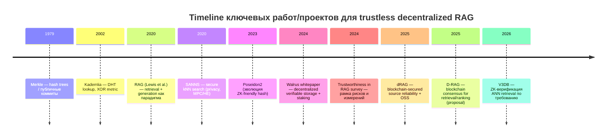

# Децентрализованные и доверенно-независимые протоколы Retrieval‑Augmented Generation

## Исполнительное резюме

Децентрализованный/«trustless» RAG (Retrieval‑Augmented Generation) — это попытка превратить ключевой «узкий» момент современных агентных систем (доверие к извлечению контекста и его происхождению) в проверяемый, распределённый протокол: данные остаются у владельцев или в нейтральном P2P‑хранилище, а результаты retrieval можно независимо верифицировать (криптографически и/или экономически). Базовая идея RAG как сочетания параметрической памяти модели и непараметрической «внешней памяти» через dense‑retriever и индекс впервые формализована в работе entity["people","Patrick Lewis","rag first author"] и соавт. (2020). citeturn21search4

На практике **полностью «end‑to‑end trustless децентрализованный RAG» пока редок**: большинство систем закрывают лишь часть цепочки (хранение, индексацию, доказуемость retrieval, репутацию источников, аудируемость), а генерация LLM и точность «использования» контекста остаются слабым звеном (то есть можно доказать корректность retrieval, но не факт корректного ответа). Этот разрыв хорошо виден в систематизации рисков и измерений доверенности RAG (фактичность, робастность, прозрачность, подотчётность, приватность и др.). citeturn21search1turn21search5

Ключевые «якорные» примеры и ближайшие аналоги:

- **Верифицируемый векторный поиск (retrieval verification)**: работа V3DB (2026) предлагает *audit‑on‑demand* ZK‑доказательства корректности ANN‑retrieval (IVF‑PQ) относительно коммитнутого снапшота корпуса, сохраняя приватность эмбеддингов/индекса. Это, по сути, самый прямой академический ответ на вопрос «как сделать retrieval trustless» для RAG‑стека, хотя сама служба может оставаться централизованной. citeturn3view0turn3view1turn3view2turn22view0  
- **Децентрализация качества источников / «trust layer» поверх retrieval**: dRAG (2025) предлагает архитектуру, где data‑owners держат источники у себя, а оценка надёжности источников и лог обновлений реализованы через смарт‑контракт (указано на entity["organization","Ethereum","blockchain platform"]). Это улучшает прозрачность/неподделываемость «scoreboard», но не даёт строгого криптографического доказательства корректности ANN‑поиска у каждого владельца данных. citeturn16view0turn22view1turn13view0  
- **Блокчейн‑ориентированный консенсус по retrieved‑контексту**: D‑RAG (2025) проектирует «Retrieval Blockchain», где кворум «майнеров» сам извлекает и ранжирует документы и фиксирует хеш ответа в блоке; также описываются приватные голосования/членство через ZK‑конструкции (Schnorr ZK‑OR и шифрование голосов). Это концептуально интересно, но выглядит тяжёлым по latency/стоимости и по уровню формализации/реалистичности модели угроз. citeturn8view0turn8view1turn8view2  
- **Децентрализованное «нейтральное» хранилище с проверяемостью**: IPFS/Filecoin/Walrus дают строительные блоки для происхождения/целостности (content addressing, CIDs, экономические рынки доставки, storage proofs, on‑chain coordinators). Особенно близок к требованиям RAG слой Walrus: дизайн ориентирован на integrity/auditability/availability blob‑ов плюс staking/rewards/penalties. citeturn25view2turn25view3turn18view1turn18view2turn18view3turn17view1  
- **Экономика и спор‑резолвинг для индексации/извлечения (не векторного по смыслу, но релевантного как протокольный шаблон)**: entity["organization","The Graph","web3 indexing protocol"] — децентрализованный протокол индексации/запросов к блокчейн‑данным со staking и механизмами dispute/verification; его модель полезна как «референс» для рынков retrieval‑услуг. citeturn6search2turn6search18turn6search38  

Главный инженерный вывод: сегодня наиболее реалистичны **гибридные «trustless‑по‑частям» архитектуры**: content‑addressed хранилище + коммит/версирование индекса + доказуемость retrieval (ZK/ADS/TEE) + прозрачные логи/таймстемпы + экономические стимулы и спор‑резолвинг. Полностью распределённый P2P‑векторный индекс с доказуемым top‑k (в смысле ANN‑семантики) остаётся исследовательским фронтиром.

## Определения и модель угроз

**RAG** в каноническом виде — это архитектура, где генератор (seq2seq/LLM) получает дополнение к промпту из внешнего корпуса, извлечённого retriever‑ом по dense‑индексу; ключевые свойства — актуализируемость памяти, возможность provenance и потенциальное снижение галлюцинаций. citeturn21search4turn21search3

**Децентрализованный RAG** в строгом протокольном смысле: по крайней мере один из критических ресурсов — **корпус** и/или **индекс** и/или **исполнение retrieval‑запросов** — контролируется не единым оператором, а множеством независимых участников; сеть должна жить при churn и частичной недобросовестности (Byzantine/рациональные атакующие). Примеры «частичной децентрализации»: data‑owners держат свои данные и API независимо (dRAG), P2P‑хранилище (IPFS/Walrus), рынок доставки (Filecoin Retrieval Market). citeturn16view0turn25view2turn25view3turn18view3

**Trustless / доверенно‑независимый RAG**: корректность ключевых шагов (по крайней мере integrity и версия/происхождение retrieved‑контекста; в идеале — корректность выполнения retrieval‑алгоритма и политики выбора top‑k) должна быть **проверяема верификатором** без доверия к оператору. На практике это достигается комбинацией:
- криптографических доказательств (Merkle‑пути, ADS‑доказательства, ZK‑SNARK/STARK, подписи, commitments);
- доверенных аппаратных корней (TEE с attestation);
- экономического «вынужденного честного поведения» (staking/slashing, challenge‑протоколы, dispute resolution). citeturn21search2turn3view0turn19search3turn18view2turn6search2

**Модель угроз** (минимально достаточная для протокольного анализа):

- **Злонамеренный провайдер retrieval/индекса**: подмена результатов (не‑top‑k), скрытая деградация качества (экономия compute), bias, цензура, выдача результатов со старого снапшота (staleness). V3DB буквально формулирует «accountability gap» dense retrieval‑API: клиент видит лишь top‑k без проверяемого следа. citeturn3view0turn4search1  
- **Злонамеренный поставщик данных**: data poisoning (вставка токсичных/ложных документов), «whitewashing» репутации, подмена версий, семантические атаки на чанкинг/эмбеддинги. Риски доверенности RAG систематизируются в обзорной рамке (robustness/transparency/accountability/privacy). citeturn21search1turn21search5  
- **Сетевая среда с churn и Sybil‑атаками**: узлы исчезают/возвращаются, создаются псевдо‑идентичности для захвата маршрутизации/кворума. Типовые предпосылки и проблемы P2P‑взаимодействия отражены в классических DHT‑подходах (Kademlia) и современных P2P‑стеках (libp2p). citeturn6search3turn2view3  
- **Атаки на приватность**: утечки query‑вектора/интересов клиента, утечки структуры индекса/доступ‑паттернов, membership inference по retrieved‑контексту. Это отдельная ветка работ по private ANN / kNN (SANNS, Wally, PACMANN), где цель — скрыть query и/или access patterns, но обычно ценой латентности/коммуникации. citeturn34view0turn40view0turn36view1turn34view3  
- **Компрометация TEE/криптопримитивов**: TEE требуют доверия аппаратному производителю/микроархитектуре; в работах по secure search явно подчёркивается, что SGX‑модель доверия отличается от «криптографической». citeturn33view0turn19search3  
- **Реплей и «подмена времени»**: выдача устаревших подтверждений/логов; решается таймстемпами (RFC 3161), прозрачными append‑only логами (Certificate Transparency‑подобные структуры) и/или on‑chain якорением. citeturn19search0turn19search1turn19search2  

## Ландшафт публикаций, спецификаций и проектов

Ниже — **сравнительная таблица** наиболее показательных работ/систем (как прямых примеров, так и ближайших «строительных блоков»). Во многих строках «verification» относится к retrieval/целостности данных, а не к истинности финального LLM‑ответа.

| name | type | year | primitives used | decentralization model | verification method | status/link |
|---|---:|---:|---|---|---|---|
| Retrieval‑Augmented Generation for Knowledge‑Intensive NLP Tasks | paper | 2020 | dense retrieval + vector index | обычно централиз. индекс | provenance как открытая проблема | arXiv/NeurIPS citeturn21search4turn21search3 |
| Trustworthiness in RAG Systems: A Survey | paper | 2024 | рамка оценивания доверенности | n/a | taxonomy/benchmarks | arXiv citeturn21search1turn21search5 |
| V3DB: Audit‑on‑Demand ZK Proofs for Verifiable Vector Search | paper + code | 2026 | ZK (Plonky2), Merkle commitments, Poseidon | недоверенный провайдер (может быть централиз.) | audit‑on‑demand ZK‑доказательство корректности IVF‑PQ top‑k на коммит‑снапшоте | arXiv + repo citeturn3view0turn3view2turn22view0 |
| A Decentralized RAG System with Source Reliabilities Secured on Blockchain (dRAG) | paper + code | 2025 | signatures (ECDSA), on‑chain logs/scoreboard | data‑owners децентрализованы; trust layer на блокчейне; LLM‑service может быть множественным | аудируемые on‑chain обновления reliability; подписи источников на state digest | arXiv html + repo citeturn16view0turn22view1 |
| D‑RAG: Privacy‑Preserving Framework for Decentralized RAG Using Blockchain | paper | 2025 | ZK‑OR Schnorr, homomorphic tally, signatures, hash anchoring | communities + permissioned chains + «Retrieval Blockchain» | консенсус по top‑k и хеш‑якорение ответов | PDF citeturn8view0turn8view1turn8view2 |
| Walrus: Efficient Decentralized Storage Network | whitepaper/spec | 2024–2025 | erasure coding, authenticated data structures, commitments, signatures, staking | permissionless storage committee + epochs | storage proofs/challenges; on‑chain координация; verifiable reads/writes (as designed) | whitepaper + arXiv citeturn18view1turn18view2turn18view3turn17view1 |
| IPFS Content Addressing + CID spec | spec/docs | ongoing | hashes, multiformats | P2P content addressing | проверка целостности через CID (hash) | docs/spec citeturn25view2turn6search12 |
| Filecoin Retrieval Market | spec + code | ongoing | payment channels, data transfer protocols | рынок retrieval‑провайдеров | протокольные проверки передачи + экономические контуры оплаты | spec + impl citeturn25view3turn6search17 |
| The Graph Network (staking, disputes) | protocol/docs | 2019→ | staking/slashing, arbitration/disputes | indexers/curators/delegators | воспроизведение работ и dispute‑процесс для «неверных» ответов | docs/blog citeturn6search2turn6search18turn6search38 |
| Authenticated Data Structures, Generically | paper | 2014 | collision‑resistant hashes, signatures, ADS proofs | n/a | компактные доказательства корректности операций над структурами | PDF citeturn21search2turn21search6 |
| Certificate Transparency (append‑only logs) | spec (RFC) | 2013 | Merkle trees, signatures | публичные независимые логи | inclusion/consistency proofs | RFC citeturn19search1turn19search5 |
| Intel SGX Explained | paper | 2016 | TEEs + remote attestation | централиз. железо, но trust‑anchor | аппаратная гарантия integrity/confidentiality (при доверии SGX) | PDF/ePrint citeturn19search3turn19search11 |
| Sigstore Rekor transparency log | docs + OSS | ongoing | signatures, append‑only log | централиз./федер. лог (может быть replicated) | inclusion proofs, tamper‑evidence | docs + repo citeturn19search2turn19search6 |

Чтобы «увидеть» архитектурные семейства, полезно разделить решения по тому, **где лежит доверие/проверяемость**: в доказательствах retrieval, в доказательствах хранения, в социально‑экономическом слое (stake/disputes), или в TEE.

```mermaid
flowchart LR
  subgraph A[Паттерн A: Контент‑адресация + коммиты + проверяемое хранение]
    U[Клиент/Агент] --> Q[Запрос]
    Q --> R[Retrieval‑узлы]
    R -->|возвращают CID/док+метаданные| U
    DS[(P2P хранилище)] -->|блоки по CID| R
    L[Ledger/Chain] -->|root/версии/параметры| U
    L -->|коммиты снапшотов/манифесты| R
  end

  subgraph B[Паттерн B: Trustless retrieval по ZK/ADS (вычисление доказуемо)]
    U2[Клиент/Агент] --> qemb[Query embedding]
    qemb --> VS[Vector Search Service]
    VS --> topk[top-k + evidence]
    topk --> U2
    VS --> proof[ZK/ADS proof on demand]
    proof --> U2
    L2[(Commitment root)] --> VS
    L2 --> U2
  end
```

```mermaid
flowchart TB
  subgraph C[Паттерн C: Экономика + спор‑резолвинг (опционально с ZK)]
    Consumer[Потребитель/агент] --> Query
    Query --> Provider[Indexer/Retriever Provider]
    Provider --> Answer[Ответ + receipts]
    Answer --> Consumer
    Provider --> Stake[Stake]
    Verifier[Challenger/Verifier] --> Dispute
    Dispute --> Slash[Slashing/penalty]
    Slash --> Stake
    Ledger[(On-chain registry/log)] --> Dispute
    Ledger --> Provider
    Ledger --> Consumer
  end
```

### Краткий каталог ключевых работ и систем

Ниже — «карточки» по наиболее релевантным материалам (с акцентом на *децентрализацию* и *trustless‑механики*).

**V3DB: Audit‑on‑Demand Zero‑Knowledge Proofs for Verifiable Vector Search over Committed Snapshots (2026)**  
Авторы: entity["people","Zipeng Qiu","v3db author"], entity["people","Wenjie Qu","v3db author"], entity["people","Jiaheng Zhang","v3db author"], entity["people","Binhang Yuan","v3db author"]. citeturn3view0turn4search1  
Кратко: verifiable/версионируемая служба ANN‑поиска, которая коммитится к снапшоту корпуса и по запросу/челленджу выдаёт короткое ZK‑доказательство того, что top‑k получен *точно* выбранной «публичной» семантикой IVF‑PQ над коммитнутым снапшотом, без раскрытия эмбеддингов и приватного индекса. citeturn3view0turn3view1turn3view2  
Технические вклады: фиксирование «fixed‑shape semantics» IVF‑PQ для ZK; коммит снапшота + Merkle‑аутентификация значений внутри доказательства; оптимизация proving за счёт multiset‑проверок вместо дорогих внутрисхемных sort/random access; прототип на Plonky2 с мс‑верификацией. citeturn3view1turn3view2turn4search1turn22view0  
Ограничения: сфокусировано на конкретном ANN‑pipeline (IVF‑PQ) и модели «audit‑on‑demand» (не «proof‑with‑every‑query»); не решает «faithfulness» генератора; децентрализация index‑исполнителей/узлов вне ядра статьи (но совместима как модуль). citeturn3view0turn4search1  

**A Decentralized Retrieval Augmented Generation System with Source Reliabilities Secured on Blockchain (dRAG, 2025)**  
Авторы: entity["people","Yining Lu","drag author"], entity["people","Wenyi Tang","drag author"], entity["people","Max Johnson","drag author"], entity["people","Taeho Jung","drag author"], entity["people","Meng Jiang","drag author"]. citeturn13view0turn11search0  
Кратко: децентрализованные источники данных управляются владельцами; LLM‑service роутит запросы к источникам, а оценка reliability/usefulness источников фиксируется и обновляется через смарт‑контракт, создавая «тампер‑пруф» историю оценок. citeturn16view0turn22view1  
Технические вклады: формализация reliability как вклад retrieved‑фрагментов в качество ответа (включая варианты оценивания importance, обновления и reranking); on‑chain trust layer с логированием; защита обновлений через подписи владельцев источников по state digest, чтобы обновления можно было привязать к «легитимному» запросу. citeturn16view0turn22view1  
Ограничения: строгая верификация корректности ANN‑поиска у каждого источника не является центральным результатом; значительная часть доверия остаётся на стороне LLM‑service (семантика чанкинга/эмбеддинга/ранжирования). citeturn16view0turn22view1  

**D‑RAG: A Privacy‑Preserving Framework for Decentralized RAG Using Blockchain (2025)**  
Авторы: entity["people","Tessa E. Andersen","d-rag author"], entity["people","Ayanna Marie Avalos","d-rag author"], entity["people","Gaby G. Dagher","d-rag author"], entity["people","Min Long","d-rag author"]. citeturn8view0turn7view1  
Кратко: предлагается «Retrieval Blockchain», где кворум майнеров извлекает документы, ранжирует их (LLM‑подсказками), достигает консенсуса по top‑k и фиксирует ссылку на зашифрованный ответ плюс хеш ответа on‑chain. Отдельно описаны «communities» с permissioned blockchain для валидации/добавления знаний. citeturn8view1turn8view2turn7view1  
Технические вклады: попытка превратить retrieval+ranking в консенсусный протокол («Decentralized Response Generation Protocol»); использование криптографии для приватности голосов/членства и проверяемости ответа (хеш‑якорение). citeturn8view1turn7view1  
Ограничения: протокол выглядит дорогим по latency/стоимости и зависит от доверенности/устойчивости к коллюзии кворума; не очевидна формальная корректность «semantic search + LLM ranking» как консенсусной функции и её устойчивость к Sybil/экономическим атакам. citeturn8view1turn7view1  

**Walrus: An Efficient Decentralized Storage Network (whitepaper 2024; arXiv 2025)**  
Команда: entity["organization","Mysten Labs","sui developer"] (whitepaper также описывает использование Sui как control plane). citeturn18view1turn17view1turn18view3  
Кратко: permissionless blob‑store с низкой репликационной стоимостью за счёт erasure coding (Red Stuff), epoch‑based комитетов и механизмов подтверждения корректности хранения/восстановления; включает staking‑экономику с rewards/penalties и идеи дешёвых challenge/audit. citeturn18view1turn18view2turn18view3  
Ключевой вклад для trustless RAG: Walrus‑подобный слой даёт нейтральную основу для хранения корпуса и артефактов индекса (каталоги чанков, эмбеддинги, снапшоты), плюс «публичную проверяемость» и экономику корректного хранения. citeturn18view2turn17view3turn17view1  
Ограничения: это слой хранения, а не retrieval‑доказательность; корректность поиска/ранжирования остаётся задачей верхнего уровня. citeturn18view3turn17view2  

**IPFS: content addressing и CID**  
Организация/экосистема: entity["organization","IPFS","content-addressed p2p protocol"]. citeturn25view2turn24search2  
Кратко: CID является адресом, полученным из криптографического хеша контента; это напрямую даёт проверяемость целостности (если CID совпал — блок не подменён). Спецификация CID фиксируется в multiformats. citeturn25view2turn6search12  
Ограничения: content addressing не доказывает, что вы получили «лучшие» документы по запросу, лишь что полученные документы совпадают с хеш‑коммитом. citeturn25view2  

**Filecoin Retrieval Market (спецификация)**  
Организация/экосистема: entity["organization","Filecoin","decentralized storage network"]. citeturn25view3turn6search17  
Кратко: протокол согласования сделок на доставку данных (в основном off‑chain), с использованием payment channels, query protocol и data transfer; важна композиция с content routing и передачей по CID/селектору. citeturn25view3turn6search33  
Ограничения: обеспечиваются экономические/протокольные контуры доставки, но не верификация «семантического top‑k» retrieval для RAG (это надстройка). citeturn25view3  

**OrbitDB (P2P база поверх IPFS)**  
Проект: entity["organization","OrbitDB","p2p database project"]. citeturn2view2turn25view1  
Кратко: «serverless» P2P‑БД, использующая IPFS для хранения и libp2p pubsub для синхронизации; опирается на Merkle‑CRDT/OpLog (криптографически проверяемый лог операций), что полезно для репликации метаданных/индексных артефактов в local‑first / p2p‑RAG сценариях. citeturn2view2turn25view1  
Ограничения: это не специфичный «vector DB» и не даёт доказательств top‑k; скорее инфраструктурный слой для распределённого состояния. citeturn2view2  

**Tevere (Decentralized key‑value store over IPFS)**  
Проект: entity["organization","ipfs-shipyard/tevere","ipfs shipyard project"]. citeturn25view0  
Кратко: eventually‑consistent key‑value store поверх IPFS, совместимый с Leveldown‑API; может применяться как распределённый слой для небольших индекс‑таблиц/каталогов (например, mapping «ключ→CID снапшота», версии, манифесты). citeturn25view0  
Ограничения: как и OrbitDB — не «verifiable vector search»; консистентность eventual и отсутствие встроенных экономических стимулов. citeturn25view0  

## Криптографические примитивы и техники для trustless RAG

### Коммиты, Merkle‑деревья и аутентифицированные структуры данных

**Merkle‑дерево** — базовый объект для commitment‑а большого множества данных одной «корневой» хеш‑строкой; этот стиль мышления восходит к работам entity["people","Ralph Merkle","cryptographer"] (1979) и стал каноническим в системах прозрачности/логов. citeturn20search2turn19search1turn19search5  

Для RAG это даёт два практических режима:

1) **Проверка включения**: retrieved‑документ/чанк сопровождается Merkle‑путём к корню снапшота (корень якорится в блокчейне/подписан), поэтому клиент может проверить: «этот чанк действительно принадлежит версии V корпуса». Этот подход «дешёвый» по latency и очень хорошо сочетается с content addressing (CID как локальный хеш блока) — но не доказывает оптимальность top‑k. citeturn25view2turn19search1  

2) **Проверка корректности операции над структурой**: это область *Authenticated Data Structures (ADS)*, где недоверенный провайдер выполняет операции над структурой и выдаёт компактное доказательство корректности результата. Классическая формализация общего подхода — «Authenticated Data Structures, Generically». citeturn21search2turn21search6  

V3DB прямо использует Merkle‑аутентификацию внутри ZK‑доказательства, чтобы «прибить» конкретные значения индекса/центроидов/листов к публичному commitment снапшота. citeturn3view2turn3view1  

### ZK‑доказательства и верифицируемое retrieval

ZK‑SNARK/STARK‑семейство даёт путь «не верь, проверяй» для вычислений retrieval‑пайплайна, но цена — ресурсоёмкость proving. В V3DB ключевая инженерная идея — *audit‑on‑demand*: **доказательство делается по требованию (challenge)**, а в обычном режиме сервис возвращает только результат; это снижает среднюю стоимость, сохраняя сдерживающий эффект для провайдера. citeturn3view0turn4search1  

Схема V3DB также показывает, какие части ANN‑поиска «дорогие» для ZK (sorting, random access) и как их обходят через multiset‑проверки и фиксированную семантику. citeturn3view1turn3view2  

Практический «примитивный стек» ZK часто включает:
- ZK‑дружелюбные хеш‑функции: например, Poseidon (USENIX Security 2021) и его производные, широко применяемые в доказательствах и Merkle‑коммитах внутри схем. citeturn20search0turn20search3  
- proving‑frameworks: Plonky2 как open‑source система рекурсивных доказательств (при этом проект публично помечает deprecation и рекомендует переход на Plonky3). citeturn22view2turn20search1  

### Подписи, attestations и «tool receipts»

В распределённом RAG «подписи» встречаются в двух местах:

- **Происхождение источника**: data‑owner подписывает манифест снапшота/версии корпуса или конкретные retrieved‑фрагменты. В dRAG описано использование ECDSA‑совместимых ключей владельцев источников на блокчейне и подписи по state digest, чтобы связывать обновления score‑ов с конкретными запросами. citeturn16view0turn22view1  
- **Аппаратная аттестация** (TEE): доверие переносится на аппарат (SGX), где enclave доказывает, что исполнялся конкретный код. Базовые гарантии SGX (integrity+confidentiality против привилегированного ПО) описаны в «Intel SGX Explained». citeturn19search3turn19search11  

Важно: TEE‑подход даёт лучшие latency/стоимость по сравнению с полной ZK‑верификацией, но вводит специфическую поверхность атак и доверие к производителю/микроархитектуре; в работах по secure search это противопоставляется «чисто криптографической» модели доверия. citeturn33view0turn19search3  

### Timestamping и публичные прозрачные логи

Для auditability критично фиксировать «когда именно» существовала версия корпуса/индекса и какой ответ был выдан. Два типовых механизма:

- **RFC 3161 Time‑Stamp Protocol** — подпись TSA над хешем данных + временем, чтобы доказать существование данных к моменту времени. citeturn19search0turn19search20  
- **Append‑only transparency logs** по образцу Certificate Transparency (RFC 6962): Merkle‑дерево добавляется только «вправо», поддерживаются inclusion/consistency proofs. Это удобно для публичных логов «какой снапшот/индекс‑root объявлялся», «какие retrieval‑сессии были обслужены» и т.п. citeturn19search1turn19search5  

Sigstore Rekor — инженерный пример «signature transparency log» с доказательствами включения и проверкой целостности лога. Он не про RAG напрямую, но даёт готовый паттерн для журналирования артефактов (манифестов, модельных билда, индексов) с проверяемостью. citeturn19search2turn19search6  

## Децентрализованное хранение и индексация для trustless RAG

### Content‑addressed корпус и снапшоты

IPFS‑модель «CID как адрес, вычисляемый из хеша контента» — фундаментальная, самая дешёвая форма проверяемости: retrieved‑объект либо соответствует CID, либо нет. CID также включает codec и представление, что важно для воспроизводимости пайплайна разбиения/кодирования. citeturn25view2turn6search12  

Для RAG практический паттерн — «корпус как набор блобов по CID + подписанный/он‑чейн манифест снапшота», где манифест содержит список CID, параметры чанкинга/нормализации и версию эмбеддинг‑модели.

### Рынок доставки и маршрутизация

Filecoin Retrieval Market формализует переговоры и протокол доставки данных от провайдера клиенту; важное замечание — значительная часть negotiation происходит off‑chain, а блокчейн участвует там, где нужны расчёты/каналы оплаты. citeturn25view3turn6search33  

Для trustless RAG это означает: даже если retrieval‑логика остаётся «надстройкой», слой доставки/доступности можно вынести в рынок, а проверяемость целостности обеспечить CID‑ами.

### Новые blob‑stores с on‑chain проверяемостью

Walrus позиционирует себя как «secure blob store» с сильной ориентацией на integrity/auditability/availability и с экономикой на staking/rewards/penalties. Белая книга описывает угрозы и предпосылки (асинхронная сеть, комитет 3f+1, Byzantine‑узлы) и goal: устойчивость при churn с дешёвыми доказательствами хранения. citeturn18view1turn18view2turn18view3  

В контексте RAG Walrus‑подобный слой может хранить: исходные документы, «gold» снапшоты датасета, артефакты пайплайна (парсинг/чанки/эмбеддинги), а в сочетании с ZK‑retrieval (как V3DB) дать end‑to‑end рассказ «какой корпус и какой retrieval‑алгоритм породили этот контекст».

### P2P‑сеть и DHT как инфраструктура discovery

Для построения P2P‑retrieval сети обычно нужны:
- p2p‑networking stack (libp2p) с шифрованием соединений, NAT traversal, multiplexing. citeturn2view3  
- распределённый key‑value discovery слой (DHT). Классический дизайн Kademlia формализует XOR‑метрику и параллельные асинхронные lookup‑и, устойчивые к отказам. citeturn6search3turn6search7  

Vector‑индексы в чистом P2P‑режиме остаются сложными: практические крупные векторные БД чаще используют координатор/шардинг/репликацию, а не «полностью peer‑to‑peer» без центральной маршрутизации. Поэтому сегодня чаще встречается гибрид «P2P storage + централизованный или федеративный retrieval + trustless verification (ZK/ADS/attestation)».

## Верификация retrieval и аудитируемость, стимулы и компромиссы производительности

### Как именно можно «проверять retrieval»

Есть несколько уровней строгости — от дешёвых к дорогим:

**Проверка целостности и версии данных**  
1) документы/чанки идут по CID, плюс Merkle‑proof включения в снапшот, закреплённый подписью/он‑чейн. Это обеспечивает «документ не подменён» и «принадлежит версии V». citeturn25view2turn19search1  

**Проверка корректности вычисления поиска**  
2) ADS‑подход: сервер выдаёт proof корректности операции (например, range query/top‑k по заданному упорядоченному ключу) — это хорошо для структурированных индексов. Общая формализация ADS как «вычисление у недоверенного провайдера + компактный proof для верификатора» дана у Miller et al. citeturn21search2  
3) ZK‑proof retrieval: как в V3DB, где доказывается корректность вычисления ANN‑pipeline над коммитнутым снапшотом с сохранением приватности индекса. citeturn3view0turn3view2  

**Проверка поведения провайдера/узла экономикой**  
4) audit‑on‑demand (V3DB) и challenge‑протоколы хранения (Walrus) — превентивная стратегия: доказательства/челленджи возникают не всегда, но достаточно часто или с достаточными штрафами, чтобы «жульничать было невыгодно». citeturn3view0turn18view2  
5) dispute resolution + slashing: модель entity["organization","The Graph","web3 indexing protocol"] показывает протокольный подход, где значимость staking требует механизма воспроизводимой проверки и наказаний за неверные ответы через dispute. citeturn6search2turn6search18  

### Экономика и incentive‑модели (tokenization, staking, slashing)

- Walrus явно описывает staking‑экономику с rewards/penalties и governance параметров через токен WAL (в whitepaper и блоге). citeturn18view2turn18view1turn17view1  
- The Graph использует модель «work token»: индексаторы должны стейкать токен, есть сигналы кураторов, вознаграждения и механизм dispute, где индексаторы могут быть slashed при споре. citeturn6search2turn6search18turn6search38  
- Filecoin Retrieval Market использует экономику сделок/платёжных каналов и протокол передачи данных; это скорее рынок доставки, чем верификация «семантического top‑k». citeturn25view3turn6search5  

Для RAG‑протокола «в духе Web3» ключевой проектный вопрос: **что именно стейкается и что именно можно slash‑ить**? В retrieval‑мире естественные «slashing events» — доказанная выдача результата, не соответствующего публичной семантике (как ZK‑challenge в V3DB), отказ от хранения/доставки (как storage proofs), цензура по доказуемому запросу, или публикация поддельных манифестов версия/хешей.

### Производительность, масштабируемость и latency‑компромиссы

- Полные ZK‑доказательства вычислений традиционно тяжёлые; поэтому появляются схемы «по требованию» (V3DB) и оптимизации proving времени/памяти. citeturn3view0turn3view1  
- TEE даёт более низкую задержку на запрос, но вводит риски аппаратного доверия и сложный operating model (attestation, обновления, side‑channels). citeturn19search3turn33view0  
- Децентрализация через консенсус по каждому запросу (как попытка в D‑RAG) почти наверняка ухудшит latency и стоимость; такие дизайны требуют либо очень сильной оптимизации, либо перехода к «батчингу/асинхронной финализации» и выборочному аудиту. citeturn8view1  
- Сильная приватность retrieval часто конфликтует со скоростью: SANNS (2020) показывает криптографически строгую модель приватности, но стоимость протоколов secure kNN существенна; Wally предлагает прагматичный масштабируемый private search подход с акцентом на компромиссы (включая differential privacy и SHE‑оптимизации). citeturn34view0turn40view0turn39view0  

## Пробелы, открытые проблемы и направления исследований

### Что пока «не закрыто» в trustless decentralized RAG

**Доказуемый semantic top‑k для ANN в распределённом режиме**  
V3DB — сильный шаг для централизованного (или федеративного) сервиса, но «P2P‑векторный индекс с доказуемостью top‑k» остаётся открытым: нужно одновременно решить (1) маршрутизацию/шардинг, (2) доказуемость корректности на шардах, (3) доказуемый merge top‑k из частичных результатов, (4) устойчивость к churn и Sybil, (5) приемлемую стоимость доказательств.

**Связка «верифицируемый retrieval → верифицируемая генерация/faithfulness»**  
Даже идеальный retrieval не гарантирует, что LLM корректно использовала контекст. Обзор по доверенности RAG подчёркивает, что trustworthiness шире retrieval‑точности и включает прозрачность/подотчётность и т.д. citeturn21search1turn21search5  
Практический вектор: комбинировать доказуемый retrieval (V3DB‑подобно) с «tool receipts»/прозрачными логами выполнения агентов, а позже — с ZK‑верификацией отдельных критичных частей inference (в смежной области есть zkLLM и zkGPT как попытки доказуемого LLM inference). citeturn29search5turn29search22turn19search2  

**Надёжная экономика retrieval‑рынков**  
Слэшинг должен быть детерминированным и «доказуемым». The Graph показывает, что dispute/арбитраж — сложная часть протокола и часто требует полу‑социальных механизмов. citeturn6search2turn6search18  
В retrieval/RAG контексте критерии «правильности» сложнее, чем для блокчейн‑состояния; поэтому особый интерес представляют схемы вроде (a) публичной семантики retrieval‑алгоритма (V3DB), (b) commit‑to‑index + ZK/ADS доказательства, или (c) стандартизованные тестовые запросы и randomly sampled audits.

**Стандартизация интерфейсов retrieval и доказательств**  
Для «протокола» важны стандарты: формат манифеста корпуса, формат доказательств, способы versioning и совместимость между узлами. В мире хранения такие стандарты хорошо развиты (CID/multiformats). citeturn6search12turn25view2  
Для retrieval‑доказательств стандарты только формируются и часто привязаны к конкретному индексу/пайплайну.

### Рекомендованные следующие шаги для R&D и прототипирования

**Архитектурный прототип с быстрым «trustless‑эффектом»**  
1) Хранилище корпуса: content addressing (IPFS‑CIDs) + манифест снапшота (список CID, параметры чанкинга/эмбеддинга) + подпись data‑owner (или on‑chain якорение root). citeturn25view2turn19search0  
2) Retrieval‑сервис: начать с централизованного векторного поиска, но добавить **версионирование снапшотов** и **доказательства корректности retrieval по челленджу** (идеологически близко V3DB). citeturn3view0turn4search1  
3) Audit log: append‑only log (Rekor‑стиль) для публикации «(query hash, snapshot id, returned CIDs, proof hash)» с inclusion proofs. citeturn19search2turn19search6  
4) Экономика: staking для retrieval‑операторов + случайные audits; slashing при провале верификации доказательства или при конфликте логов. (В качестве шаблонов смотреть Walrus economics и Graph disputes.) citeturn18view2turn6search18  

**Исследовательская дорожная карта**  
- «Proof‑carrying retrieval» для популярных индексов (HNSW, IVF‑Flat, IVF‑PQ): перенос идей V3DB на другие ANN‑семантики. citeturn3view1turn4search1  
- Композиция доказательств в multi‑shard retrieval: доказуемый merge top‑k + доказуемая маршрутизация/раскладка.  
- Модели «разреженного аудита» и стратегия выбора челленджей (audit‑on‑demand как дизайн‑паттерн). citeturn3view0  
- Приватный trustless retrieval: комбинировать PIR/secure search подходы (SANNS/Wally‑линия) с доказуемостью корректности (ZK/ADS) — это крайне сложно, но стратегически важно для privacy‑sensitive RAG. citeturn34view0turn40view0turn39view0  

### Что читать в первую очередь

1) V3DB (retrieval‑доказательность для ANN и дизайн audit‑on‑demand). citeturn3view0turn4search1turn22view0  
2) dRAG (блокчейн как управление надёжностью источников и auditable logging). citeturn16view0turn22view1  
3) Walrus whitepaper/arXiv (proof‑и и экономика децентрализованного хранилища, пригодного для «нейтральных» корпусов). citeturn18view1turn18view3  
4) Miller et al. про ADS (теоретический инструмент для «untrusted prover + verifier» в запросах). citeturn21search2  
5) IPFS CID + Filecoin retrieval market spec (практическая база storage/delivery). citeturn25view2turn25view3  
6) Survey по trustworthiness RAG (чтобы не свести проблему только к retrieval). citeturn21search1turn21search5  



```text
Прямые ссылки (URL) на первоисточники (без пояснений)
https://arxiv.org/abs/2603.03065
https://github.com/TabibitoQZP/zk-IVF-PQ
https://arxiv.org/html/2511.07577v1
https://github.com/yining610/Reliable-dRAG
https://aircconline.com/csit/papers/vol15/csit150417.pdf
https://sonnino.com/papers/walrus-whitepaper.pdf
https://arxiv.org/pdf/2505.05370
https://docs.ipfs.tech/concepts/content-addressing/
https://github.com/multiformats/cid
https://spec.filecoin.io/systems/filecoin_markets/retrieval_market/
https://thegraph.com/docs/en/subgraphs/explorer/
https://www.cs.umd.edu/~mwh/papers/gpads.pdf
https://www.rfc-editor.org/rfc/rfc6962.html
https://www.rfc-editor.org/rfc/pdfrfc/rfc3161.txt.pdf
https://docs.sigstore.dev/logging/overview/
https://github.com/sigstore/rekor
```