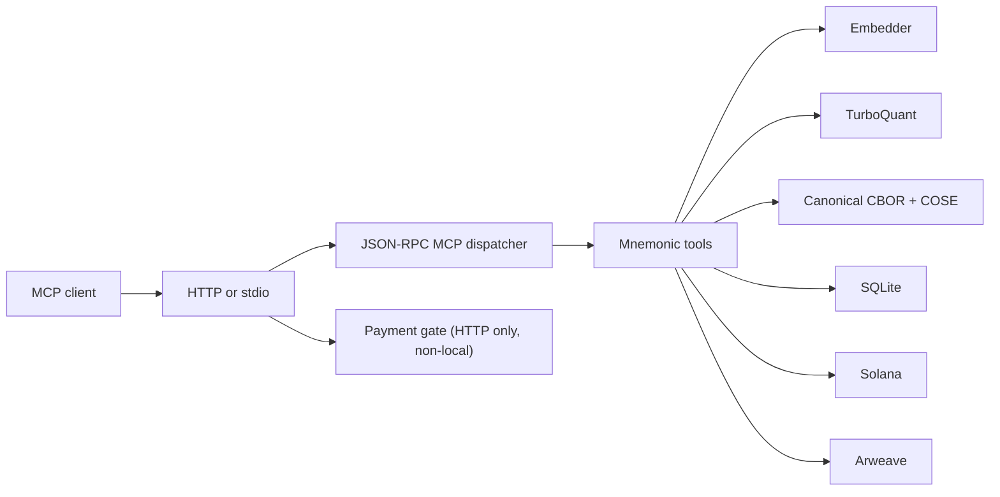

# Mnemonic MCP Server — Technical Specification

**Implementation:** `mcp` (Rust)  
**Date:** 2026-04-15  
**Status:** Updated to current `main`

---

## 1. Purpose

`mcp` is the active Rust MCP server implementation for Mnemonic.

It gives an AI agent a persistent and verifiable artifact/memory layer by:

1. embedding user content with a configured semantic embedder
2. compressing embeddings with TurboQuant
3. canonicalizing artifacts into deterministic CBOR
4. hashing canonical bytes with **blake3**
5. signing artifacts as **COSE_Sign1** using the server Ed25519 identity
6. persisting either:
   - locally in SQLite (`local` mode), or
   - to Arweave + Solana + SQLite (`full` mode)
7. exposing search and verification over MCP

---

## 2. Architecture



Core modules:

- transport: stdio + HTTP
- JSON-RPC dispatcher: MCP methods and tool routing
- tool layer: 5 Mnemonic tools
- codec layer: schema registry, canonical CBOR, hashing, signing
- persistence layer: SQLite attestation index and payment tables
- external adapters: Solana and Arweave
- payment/pricing layer: balance + x402 + dynamic pricing

---

## 3. Transports

### HTTP

Axum server exposing:

- `POST /mcp`
- `POST /api-keys`
- `GET /balance`
- `POST /deposit`
- `GET /admin/stats`
- `GET /health`

Payment gating is enforced only for `mnemonic_sign_memory` when:

- transport is HTTP
- `PAYMENT_MODE != none`
- `STORAGE_MODE != local`

### stdio

Trusted local process transport.

- JSON-RPC over stdin/stdout
- payment bypassed

---

## 4. Identity

Each server instance has a single Ed25519 keypair loaded from `MNEMONIC_KEYPAIR_PATH`.

The keypair is used for:

- COSE artifact signing
- Solana memo transactions in `full` mode
- identity challenge signing

Derived identifiers:

- `did:sol:<base58_pubkey>`
- `did:key:z6Mk...`

---

## 5. Storage model

Current implementation has two first-class storage modes.

### `STORAGE_MODE=local` (default)

Purpose:
- cheap, offline, instant local development mode

Behavior:
- SQLite persistence only
- no Arweave writes
- no Solana writes
- synthetic ids returned:
  - `solana_tx = local:<...>`
  - `arweave_tx = local:<...>`
- HTTP sign-memory payment gate bypassed

This mode is ideal for:
- development
- demoing MCP behavior without blockchain cost
- validating recall and local verification UX

### `STORAGE_MODE=full`

Purpose:
- durable external persistence and anchoring

Behavior:
- signed COSE bytes stored on Arweave
- anchor memo written to Solana
- SQLite stores local searchable state
- HTTP payment gate active if payment mode enabled

---

## 6. Sign-memory pipeline

Current pipeline:

```text
content
  → embed
  → TurboQuant compress
  → build typed artifact JSON
  → canonical CBOR
  → blake3(content_cbor)
  → COSE_Sign1
  → persist (local or full)
  → save SQLite row + full embedding
```

### Artifact construction

`mnemonic_sign_memory` currently builds a typed `memory` artifact with fields like:

- `artifact_id`
- `type = memory`
- `schema_version = 1`
- `content`
- `producer`
- `created_at`
- `tags`
- `metadata.embed_provider`
- `metadata.embed_dim`
- `metadata.turbo_bits`
- `metadata.embedding_compressed`

### Hashing

Current artifact hash:

- **blake3 over canonical CBOR bytes**

This replaces the older raw-content SHA-256 model.

### Signing

Artifacts are signed as:

- **COSE_Sign1**
- Ed25519 key from the server identity

### Persistence behavior by mode

#### local mode

- no external network persistence
- returns synthetic ids
- saves attestation and embedding to SQLite

#### full mode

- stores COSE bytes on Arweave
- anchors memo on Solana with:

```json
{"h":"<blake3>","a":"<arweave_tx>","m":"<embed_model>","v":3}
```

- saves attestation and embedding to SQLite
- records attestation cost info

---

## 7. Verification model

Current verification is version-aware.

### Full-mode current artifacts

Verification path:

1. read anchor from Solana when available
2. fetch bytes from Arweave
3. detect COSE/current artifact format
4. verify COSE signature and content integrity
5. compare expected hash when present

Returned checks include:

- `content_integrity`
- `cose_signature`
- `algorithm_valid`

### Legacy artifacts

If artifact looks like the older model, verification falls back to:

- raw JSON payload parse
- SHA-256 recompute over content

### Local mode

Local mode verification:

- looks up the attestation in SQLite by local tx id
- performs local integrity checking
- returns a local note instead of claiming full Arweave/Solana proof

This makes verification behavior explicitly dependent on the storage model and artifact version.

---

## 8. Embedding model

Current production embedder options:

| Provider | Status | Notes |
|----------|--------|-------|
| `fastembed` | default | local ONNX, open weights, externally verifiable, feature-gated via `local-embed` |
| `openai` | supported | semantic but proprietary, not externally verifiable |
| `hash` | test-only | deterministic fallback for tests, not valid production semantic retrieval |

Important current config facts:

- `EMBED_PROVIDER` default is **`fastembed`**
- if `fastembed` is unavailable and an OpenAI key exists, code can fall back to OpenAI
- recall quality in production depends on using a real semantic embedder

---

## 9. Recall model

`mnemonic_recall` currently searches:

- full embeddings stored in SQLite

It does **not yet** run retrieval over a local compressed shadow index.

Compressed embeddings are still useful because they are:

- generated during signing
- included in artifact metadata
- available for future reconstruction / portability / remote use

Current local recall path is therefore:

- semantic embed query
- cosine-like search over full stored embeddings
- rank and return top matches

---

## 10. Payment architecture

Payment applies only to HTTP sign-memory calls outside local mode.

### Modes

- `none`
- `balance`
- `x402`
- `both`

### Balance path

Current behavior:

- check balance against current dynamic price quote
- reserve configured amount before execution
- refund on failure

Caveat:

- reserved amount currently uses `SIGN_MEMORY_COST_MICRO_USDC`
- quote uses current pricing engine result
- these may diverge

### x402 path

- request without valid payment returns HTTP 402 challenge
- retry with `X-Payment`
- server verifies treasury transfer and nonce uniqueness

### Deposit path

Current deposit validation is stricter than the older docs:

- USDC transfer to treasury must be valid
- API key must have `owner_pubkey`
- owner pubkey must be a signer on the deposit transaction

So signer ownership verification is now implemented in code.

---

## 11. Dynamic pricing

Pricing engine periodically refreshes:

- Irys price quote
- SOL/USD price

and computes current sign-memory price.

It exposes current pricing to `/admin/stats`.

This is used by the HTTP payment gate for admission checks.

---

## 12. Database schema

SQLite contains:

- `attestations`
- `attestation_embeddings`
- `api_keys`
- `payment_events`
- `x402_nonces`
- `attestation_costs`

This supports:

- local recall
- local verification lookup
- payment balances and deposit history
- x402 replay prevention
- simple P&L stats

---

## 13. Codec layer

The current implementation now has a dedicated codec subsystem:

```text
mcp/src/codec/
  canonical.rs   — canonical CBOR conversion
  hash.rs        — blake3 hashing
  mod.rs         — codec module wiring
  schema.rs      — artifact schema registry
  sign.rs        — COSE signing / verification
```

This is the biggest conceptual shift from the older MCP server docs.

Mnemonic is no longer just producing JSON payloads with hashes; it is producing typed, canonical, signed artifacts.

---

## 14. Source map

```text
mcp/src/
├── main.rs          — CLI, HTTP router, stdio loop, payment-aware MCP entrypoint
├── mcp.rs           — JSON-RPC dispatcher, shared MCP state, tool routing
├── tools.rs         — 5 tool implementations
├── db.rs            — SQLite store, search, payment tables, P&L tables
├── config.rs        — environment config, transport/storage/payment/pricing settings
├── identity.rs      — keypair load/create, did helpers, signing helpers
├── embed.rs         — embedder trait and implementations (fastembed, OpenAI, test hash)
├── compress.rs      — TurboQuant embedding compression
├── arweave.rs       — Arweave client
├── solana.rs        — Solana memo write/read, transfer verification, tx signer lookup
├── payment.rs       — payment gate logic, x402/balance handling
├── pricing.rs       — dynamic pricing engine
├── lineage.rs       — lineage-related helpers / future DAG support
└── codec/
    ├── mod.rs       — codec module root
    ├── schema.rs    — immutable artifact schemas
    ├── canonical.rs — canonical CBOR encoding/decoding
    ├── hash.rs      — blake3 content hashing
    └── sign.rs      — COSE signing and verification
```

---

## 15. Diagram/IDE note

Mermaid is the right choice for IDE and GitHub rendering, but support depends on the editor.

Common reasons Mermaid does not display in IDE:

- IDE does not preview standalone `.mmd` files
- Mermaid preview plugin is missing
- preview only works inside Markdown fenced blocks

Practical recommendation:

- keep Mermaid source in `.mmd` files for reuse
- also embed key diagrams inside Markdown docs where IDE preview is stronger
- rename stale diagram filenames to match current module naming (`mcp`, not `mcp-server-rs`)

---

## 16. Current documentation delta resolved here

This updated spec corrects the biggest stale areas from the previous version:

- code path is `mcp/`, not `mcp-server-rs/`
- current mainline implementation uses CBOR + COSE + blake3
- storage model is explicitly documented
- verification is version-aware and storage-mode-aware
- deposit signer ownership verification is implemented
- source map includes codec layer and current modules
