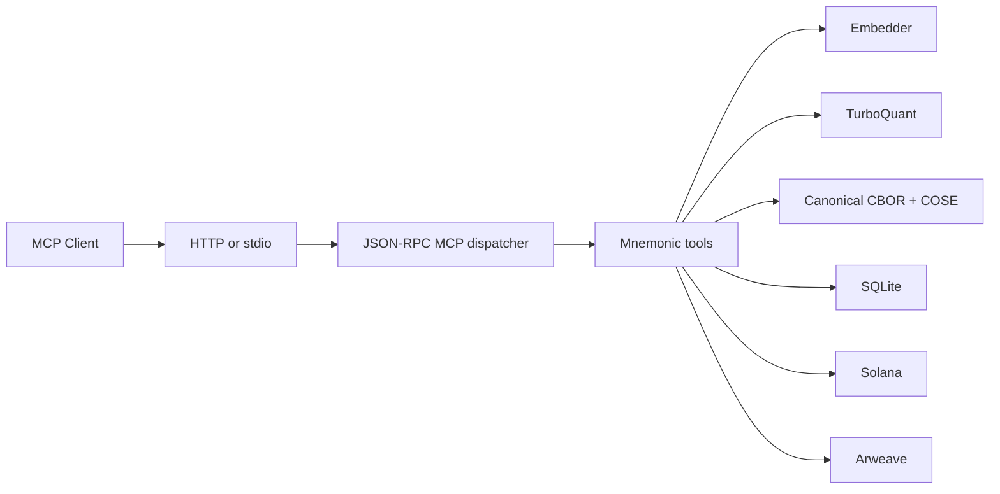

# mnemonic-mcp

Verifiable artifact and memory attestation MCP server for AI agents.

> Mnemonic gives an AI agent a cryptographic identity, a durable local or on-chain memory path, and a way to produce semantically searchable, tamper-evident artifacts.

## Status

This is the active Rust MCP implementation on `main`.

Current code includes:

- MCP over **HTTP** and **stdio**
- 5 core tools:
  - `mnemonic_whoami`
  - `mnemonic_sign_memory`
  - `mnemonic_verify`
  - `mnemonic_prove_identity`
  - `mnemonic_recall`
- SQLite local recall index
- pluggable embeddings:
  - `fastembed` local ONNX embedder when compiled with `--features local-embed`
  - OpenAI embeddings fallback / explicit mode
  - hash embedder for tests only
- TurboQuant compression of embeddings
- canonical **CBOR + COSE** artifact signing
- **blake3** content hashing
- payment modes: `none`, `balance`, `x402`, `both`
- API key creation, balance lookup, deposit crediting
- dynamic pricing engine
- admin stats and health endpoints
- dual storage modes:
  - `local` — SQLite only, free/offline, synthetic tx ids
  - `full` — Arweave + Solana + SQLite

## Key implementation model

This server now uses a two-layer representation:

- **external API surface:** JSON-RPC and JSON outputs for MCP clients
- **internal signed artifact format:** canonical CBOR + COSE_Sign1

`mnemonic_sign_memory` no longer signs a raw JSON payload with a SHA-256 content hash.
Instead, current code does:

1. embed content
2. TurboQuant compress embedding
3. build typed artifact JSON
4. canonicalize to CBOR
5. compute **blake3** hash over canonical bytes
6. sign as **COSE_Sign1** with Ed25519
7. store signed bytes on Arweave in `full` mode
8. anchor hash + arweave ref + embed model on Solana
9. save searchable state in SQLite

## Storage modes

### `STORAGE_MODE=local` (default)

Local-only mode:

- SQLite persistence only
- no Arweave write
- no Solana write
- no payment gate on sign-memory path
- synthetic local tx identifiers returned

This is the easiest way to test the MCP flow without blockchain dependencies or cost.

### `STORAGE_MODE=full`

Full persistence mode:

- COSE bytes written to Arweave
- anchor memo written to Solana
- SQLite still used for local recall/indexing
- payment gate active on HTTP if enabled

## Transports

| Mode | Use case | Config |
|------|----------|--------|
| **HTTP** | Remote MCP server | `--transport http --port 3000` |
| **stdio** | Local MCP process transport | `--transport stdio` |

## Quick start

```bash
cargo build --release

# HTTP mode
./target/release/mnemonic-mcp --transport http --port 3000

# stdio mode
./target/release/mnemonic-mcp --transport stdio
```

## Claude Code config (remote)

```json
{
  "mcpServers": {
    "mnemonic": {
      "url": "http://localhost:3000/mcp"
    }
  }
}
```

## Claude Code config (local)

```json
{
  "mcpServers": {
    "mnemonic": {
      "command": "./target/release/mnemonic-mcp",
      "args": ["--transport", "stdio"]
    }
  }
}
```

## Tool behavior summary

| Tool | Current behavior |
|------|------------------|
| `mnemonic_whoami` | returns pubkey, DIDs, attestation count, and storage mode |
| `mnemonic_sign_memory` | embed → compress → canonical CBOR → blake3 → COSE → persist |
| `mnemonic_verify` | verifies current COSE artifacts, with legacy JSON fallback and local-mode verification path |
| `mnemonic_prove_identity` | signs challenge with Ed25519 |
| `mnemonic_recall` | semantic search over SQLite-stored full embeddings |

## HTTP endpoints

- `POST /mcp`
- `POST /api-keys`
- `GET /balance?api_key=...`
- `POST /deposit`
- `GET /admin/stats?days=7`
- `GET /health`

## Testing

```bash
# library/unit tests
cargo test --lib

# protocol / integration tests
cargo test --test integration_cbor
cargo test --test proptest_canonical

# local infrastructure
bash scripts/start-local.sh

# HTTP API tests
cargo run -- --transport http --port 3000 &
bash scripts/test-http.sh 3000

# full test suite
bash scripts/run-tests.sh

# benches
cargo bench --bench decompress
cargo bench --bench cbor_codec
```

## Mermaid diagrams

Mermaid should preview in most IDEs and on GitHub when the files contain fenced ```mermaid blocks or `.mmd` Mermaid source.

If diagrams are not rendering in your IDE, it is usually one of:

- Mermaid preview extension/plugin missing
- `.mmd` not associated with Mermaid preview
- the IDE only renders Mermaid inside Markdown, not standalone `.mmd`

For that reason, the docs diagrams should stay in Mermaid syntax and be referenced from Markdown docs.

## Environment

```bash
cp .env.example .env
```

| Variable | Default | Description |
|----------|---------|-------------|
| `MCP_TRANSPORT` | `http` | `stdio` or `http` |
| `MCP_HTTP_HOST` | `0.0.0.0` | HTTP listen host |
| `MCP_HTTP_PORT` | `3000` | HTTP listen port |
| `SOLANA_RPC_URL` | `http://localhost:8899` | Solana RPC |
| `ARWEAVE_URL` | `http://localhost:1984` | Arweave gateway |
| `MNEMONIC_KEYPAIR_PATH` | `~/.mnemonic/id.json` | Ed25519 keypair |
| `DATABASE_PATH` | `~/.mnemonic/attestations.db` | SQLite path |
| `EMBED_PROVIDER` | `fastembed` | `fastembed` or `openai` |
| `OPENAI_API_KEY` | _(empty)_ | required for `openai` |
| `OPENAI_EMBED_MODEL` | `text-embedding-3-small` | OpenAI embeddings model |
| `TURBO_BITS` | `4` | TurboQuant bit width |
| `STORAGE_MODE` | `local` | `local` or `full` |
| `PAYMENT_MODE` | `none` | `none`, `balance`, `x402`, `both` |
| `TREASURY_PUBKEY` | _(empty)_ | Solana treasury pubkey |
| `USDC_MINT` | mainnet USDC | SPL token mint for payment verification |
| `SIGN_MEMORY_COST_MICRO_USDC` | `1000` | base/floor configured sign-memory charge |
| `PRICE_REFRESH_SECS` | `1800` | dynamic pricing refresh interval |
| `PRICING_MARGIN_BPS` | `2000` | pricing margin in basis points |
| `TYPICAL_PAYLOAD_BYTES` | `2048` | Irys quote payload size assumption |
| `SOL_TX_FEE_LAMPORTS` | `5000` | memo tx fee estimate |

## Architecture


